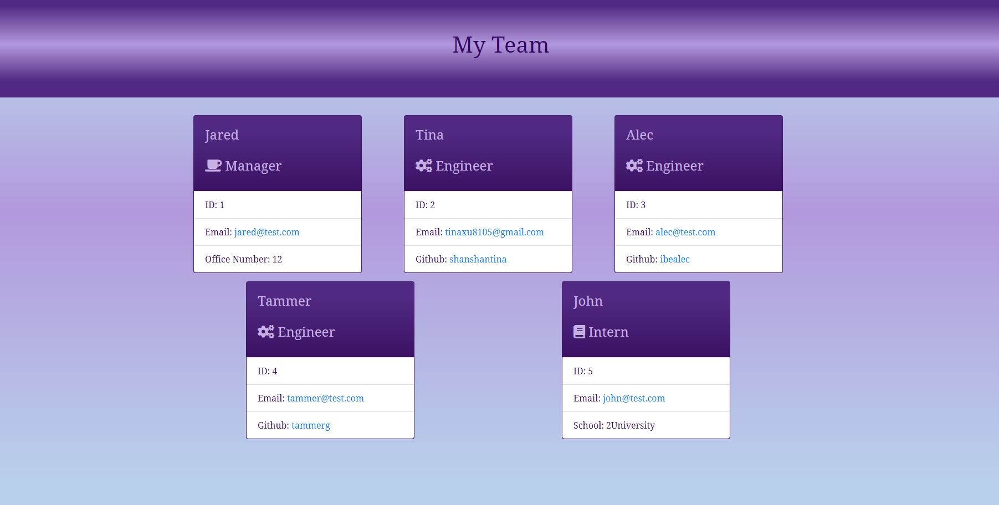

  # Team Profile Generator 

  
    
  

  ## Description
  This is a team profile generator which user can quickly and easily generate a team profile webpage with all the team members’ summary by using a Command line. This application is created by JavaScript and Node.js.   

  ## Table of Contents
  * [Installation](#installation)
  * [Usage](#usage)
  * [License](#license)
  * [Contributing](#contributing)
  * [Tests](#tests)
  * [Credits](#credits)
  * [Questions](#questions)

  ## Installation
  Instructions to get the application run:  1. Download and install [Visual Studio Code](https://code.visualstudio.com/Download) if user don't have it installed in the computer.   2. Download and install [Node.js](https://nodejs.org/en/) if user don't have it installed in the computer.   3. Open the terminal, first run `npm install inquirer` and `npm install jest –save-dev`:   * `inquirer` will prompt user for inputting the information in command line.   * `jest` for running the unit tests which only installs to devDependencies list.   The application itself runs by command `node index.js` or `node index`.

  ## Usage
  Team Profile Generator is a command-line application that accepts user input. when user prompts for the team members and their information, then an HTML file is generated that displays a nicely formatted team roster based on user input:  1. when user clicks on an email address in the HTML, then the user default email program opens and populates the TO field of the email with the address.  2. when user clicks on the GitHub username, then that GitHub profile opens in a new tab.  3. when user starts the application, then user is prompted to enter the team manager’s name, employee ID, email address, and office number.  4. when user enters the team manager’s name, employee ID, email address, and office number, then user is presented with a menu with the option to add an engineer or an intern or to finish building my team.  5. when user selects the engineer option, then user is prompted to enter the engineer’s name, ID, email, and GitHub username, and then taken back to the menu.  6. when user selects the intern option, then user is prompted to enter the intern’s name, ID, email, and school, and then taken back to the menu.  7. when user decides to finish building the team, then user exits the application, and the HTML is generated.   [Team Profile Generator Walkthrough Video](https://drive.google.com/file/d/1REMMBaRB-nIPTTmSH_oepXzlL2qfj3eB/view)   

  ## License
  
  This project is under license MIT
  
  [License Link](https://choosealicense.com/licenses/)

  ## Contributing
  Not Available 

  ## Tests
  Test by Jest.js, run the command `npm test`.   [Test Video](https://drive.google.com/file/d/1chMGsRwWuIzNpwuIPEWYCfi_8z9Z3yxM/view)   

  ## Credits
  The lists of resources used to complete this challenge:   1. Module 10 Object-Oriented Programming(OOP) from canvas.   2. Google (https://www.google.ca/)   3. Google Fonts (https://fonts.googleapis.com/css?family=Open+Sans&display=swap).   4. MDN Web Docs (https://developer.mozilla.org/en-US/docs/Web/JavaScript).  5. Node.js (https://nodejs.org/dist/latest-v12.x/docs/api/fs.html).   6.  Jest - (https://jestjs.io/docs/en/getting-started).   7. npm - inquirer (https://www.npmjs.com/package/inquirer).   8. Font Awesome (https://fontawesomeicons.com/).   9. Bootstrap (https://getbootstrap.com/).   10. Supports from instructor, assistant instructor and Tutor.

  ## Questions
  

  For any questions, please contact me with the information below:

  GitHub: [@shanshantina](https://github.com/shanshantina)

  
  Email: tinaxu84@gmail.com
